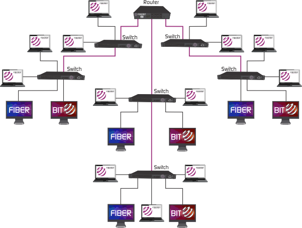

# Network+ Chapter 1

# **Topology Selection, Backbones, and Segments**

## **Selecting the Right Topology**

Ask the right questions:
- How much cash do you have?
- How much fault tolerance and security do you really need?
- How scalable does your network need to be? (will you need to quickly and easily reconfigure it often?)
- think about:
  - Cost
  - Ease of installation
  - Ease of maintenance
  - Fault-tolerance requirement
  - Security requirement

## **The Network Backbone**

We can divide a network into different parts to clearly communicate about what we're talking about.

**Backbone:** What all the network segments and servers connect to, and what gives the network its structure. Must use some kind of fast, robust technology - typically Gigabit Ethernet.

You would want to connect all of the network's servers and segments directly to the network's backbone.

**Network Segments:** Any small section of the network that may be connected to, but isn't a part of, the backbone. Workstations + servers, organised into segments connect to the backbone, which is the common connecting point for all segments.

## **Campus Area Network (CAN)**

A network that encompasses several buildings.

## **Classic Storage Area Network (SAN)**

- High-capacity storage devices connected by a high-speed private network (separate from the LAN) using a storage-specific switch.

- This storage information architecture addresses the collection, management and use of data.

- Typically fibre networks.
