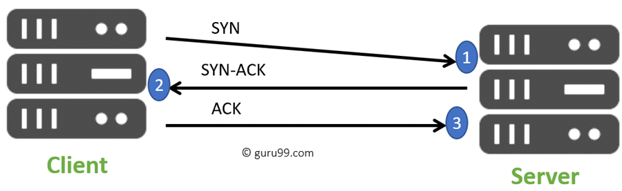

# Network+ Chapter 2

# **The OSI Reference Model**

Important function of OSI specs is to assist in data transfer between disparate hosts, regardless if they're Unix, Windows, or Mac based.

OSI model is NOT a physical model: it's a conceptual, comprehensive, yet fluid set of guidelines, which app developers utilise to create and implement applications that run on a network.

It provides a framework for creating and implementing networking standards, devices, and interconnecting schemes.

7 Layers:

> Please Do Not Throw Sausage Pizza Away.
> 

| **#** | **Layer** | **Upper/Lower** | **Functions** | **Detail** |
|---|---|---|---|---|
| **7** | **Application** | Upper | File / print / message/ DB / Application services | User Interface. |
| **6** | **Presentation** | Upper | Data encryption / compression / translation services | Presents data, handles processes (e.g. encryption). |
| **5** | **Session** | Upper | Dialog control | Keeps different application's data separate. |
| **4** | **Transport** | Lower | End-to-end connection | Provides reliable (TCP) or unreliable (UDP) delivery. Performs error **correction** before retransmit. |
| **3** | **Network** | Lower | Routing | Provides logical addressing (which routers use for path determination). |
| **2** | **Data Link** | Lower | Framing | Combines packets into bytes, bytes into frames. Provides access to media using MAC addresses. Performs error **detection** not correction. |
| **1** | **Physical** | Lower | Physical Topology | Moves bits between devices. Specifies voltage, wire speed, pin-out of cables. |

**Users interact at Application layer.**  
Upper layers responsible for applications communicating with hosts.
- None of the upper layers knows anything about networking / network addresses. That's the responsibility of the four bottom layers.

**The bottom layers define how data is transferred through physical media, switches and routers.**  
They determine how to rebuild a data stream from a transmitting host, to a destination host's application.

---
## **Application Layer**

- Where users communicate / interact with the network stack through:
  - application processes
  - interfaces
  - APIs
- that connect the application in use, to the operating system of the computer.

- Chooses and determines the availability of communicating partners, along with resources necessary to make their required connections.
  
- Sometimes computer applications require more than just desktop resources - often uniting communicating components from 1+ network application, e.g.:

    - file transfers
    - email
    - enabling remote access
    - network management activities
    - client server processes.  
    
- Co-ordinates partnering applications, and forms a consensus on procedures for controlling data integrity, and error recovery.
  
- Only used when it's apparent that access to the network is needed.
  
- Acts as an interface between the application program (that is NOT a part of the layered structure) and the next layer down, by providing ways for the application to send information down the protocol stack.

**EXAMPLE:** Take Internet Explorer (IE). You can strip all the networking bits out of it, and still use the UI. But once you need to start opening HTML through HTTP / grabbing a file through FTP, IE does this by attempting to access the Application Layer.

> **IE does NOT reside within the Application layer.**  
> It interfaces with Application Layer protocols when it needs to deal with remote resources.

## **Presentation Layer**

* Presents data to application layer.
  
* Responsible for data translation, code formatting.
  
* EXAMPLE: Data transfer technique is to adapt data into a standard format before transmission. Computers are configured to receive this generically formatted data, and converts it back o native format for reading.
  * EBCDIC to ASCII.

* Ensures data transferred from an application layer of one system can be read by the application layer of another system.
  
* OSI has protocol standards that define how standard data should be formatted.
  
* Tasks:
  
  * Data compression
  * Decompression
  * Encryption
  * Decryption

* all part of this layer.

* Some Presentation layer standards are even involved in multimedia operations.

## **Session Layer**

* Keeps applications' data separate from other applications' data, e.g. multiple web browser sessions on your desktop at the same time.

* Responsible for setting up, managing and tearing down sessions between Presentation layer entities.
* Provides dialog control between devices / nodes.
* Co-ordinates comms between systems
* Serves to organise their comms by offering the following 3 modes.
  - Full duplex
  - Half duplex
  - Simplex

## **Transport Layer**

**Multiplexing:** sending multiple signals or streams of information over a communications link at the same time in the form of a single, complex signal.

* Segments and reassembles data into a data stream.

* Services in Transport Layer handle data from upper-layer applications, and unite it onto the same data stream (multiplexing).

* Provide end-to-end transport services.

* Can establish a logical connection between sending host + destination host on an internetwork.

* Responsible for:

    * Multiplexing upper-layer applications
    * Establishing virtual connections
    * Tearing down virtual circuits

* Hides details of network-dependent info from higher layers, facilitating data transfer.

* TCP/UDP protocols exist in Transport Layer.
  * TCP: Connection-oriented
  * UDP: Connectionless

### Connection-Oriented Communication

- A **virtual circuit** needs to be created in order for the transmitting host to be able to send segments down the model.
- To create this, the sender's TCP process and the destination TCP process need to perform a **handshake**🤝.
  - They agree on the amount of info that'll be sent in either direction, the recipient TCP send an acknowledgement.

This virtual circuit setup of back and forth messages to create the circuit is called **overhead.**

1. **Synchronisation (SYN):**
   - "Agreement for connection" segment.  
   - Sets what the first sequence number should be for request packets originating from the client.

2. **Synchronisation / Acknowledgement (SYN/ACK):**
   - Sets what the first sequence number should be for response packets originating from the server. 
   - Confirms the request packet sequence number sent by the client by acknowledging it.

3. **Acknowledgement (ACK):**
   - Confirms the response packet sequence number sent by the server by acknowledging it.

Problems:
- Congestion can occur
  - High-speed computer generating lots of data traffic
  - Bunch of computers simultaneously sending datagrams through a single gateway / to destination.

### **Flow Control**

### **Windowing**

### **Acknowledgements**

## **Network Layer**

## **Data Link Layer**

## **Physical Layer**