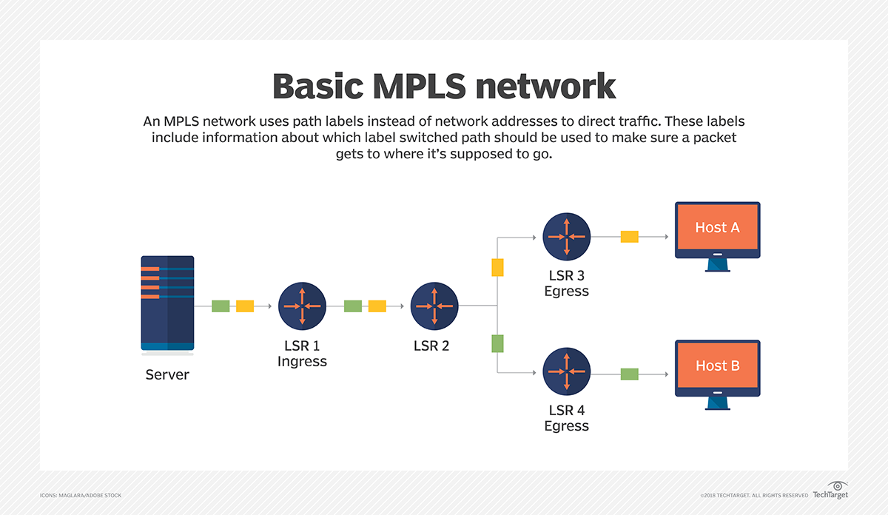

# Network+ Chapter 1

# **What is a network?**

> **A network is a *group or system of interconnected people or things.***

**LAN**: Local Area Network

**Workgroup**: A set of devices that are physically are in the same network segment. Split LANs into logical zones called "workgroups".

**Business Environment:** Better to arrange LAN's workgroups along department divisions.

Connect two or more LANs using a ***router***.

## **Common Network Components**

### **Workstations**

Powerful computeers that run more than one CPU (Central Processing Unit), and who's resources are available to other users on the network to access when needed.

Often systems that end users use on a daily basis.

Not client machines - client machines can be workstations, but not always.

### **Client Machine**

Any device on the network that can ask for access to resources / other hosts from a server or powerful workstation.

### **Servers**

Run Network OS to maintain and control the network.
Typically highly specialised, and are there  to handle one important labour-intensive job.
It's not tha ta single server can't do many jobs, but you'll get better performance if you dedicate a server to a single task.

**Common dedicated servers:**

| **Example Server Type** | **Description**                                                                                                             |
|-------------------------|-----------------------------------------------------------------------------------------------------------------------------|
| **File Server**         | Stores + dispenses files                                                                                                    |
| **Mail Server**         | Handles email functions                                                                                                     |
| **Print Server**        | Manages printers on the network                                                                                             |
| **Web Server**          | Manages web-based activities, by running Hypertext Transfer Protocol (HTTP) for storing web content and accessing web pages |
| **Fax Server**          | Sends and receives paperless faxes over the network                                                                         |
| **Application Server**  | Manages network applications                                                                                                |
| **Telephony Server**    | Handles call centre, call routing (a sophisticated network answering machine)                                               |
| **Proxy Server**        | Handles tasks in place of other machines on the network, particularly an Internet connection.                               |

### **Hosts**

Typically this term comes up when talking about the Transmission Control Protocol/Internet Protocol (TCP/IP) - means "any network device with an IP address".

## **Wide Area Networks**

Networks designed to span large geographic areas, like the Internet!
Typically employ both router and public links.

**WANs:**
- Usually need a router port / ports.
- span larger geographic areas.
- are usually slower.
- We can choose when and how long we connect to a WAN. With a LAN, it's all or nothing.
- Can utilise either private / public data transport media e.g. phone lines.

Internet --> Internetwork --> a type of LAN / WAN that connects to a bunch of networks / "intranets".
On an internetwork, you use:
- **Hardware addresses** to communicate with other hosts on the LAN.
- **Logical addresses** to communicate with hosts on other LANs (other side of the router).

Routers make internetworks possible. Each connection into a router is a different logical network. 

- **Distributed WAN** = Internet.
- **Centralised WAN** = Main centrally located computer / location that remote computers and devices can connect to.

### **MPLS**

Multiprotocol Label Switching. A WAN protocol. Switching mechanism that imposes **labels** (numbers) to data, then uses those labels to forward data when it arrives at the MPLS network.

Advantages over other WAN technologies:

- Physical layout flexibility
- Prioritising of data
- Redundancy in case of link failure
- One-to-many connection

Labels are assigned on the edge of the MPLS network. Forwarding inside the MPLS network (cloud), and is done solely based on labels through virtual links instead of physical links.

Can provide data prioritisation --> voice data could have priority over basic data based on the labels.

Redundancy provided --> multiple paths for the data to be forwarded. 

## **Network Architecture**

### **Peer-to-Peer Network**

Computers connected together in peer-to-peer networks do NOT have any central / special authority. They're all **peers,** so they're all **equal**.

The authority to perform a security check for proper access rights, lies with the computer that has the desired resource.
- Basically, if you own the resource, you hold the access rights, and so you can do the security check for hosts that want to access your file.

This means computers existing on a peer-to-peer network can be client machines that access resources, and server machines that provides their resources to other computers.

Backing up company data on a P2P network can be tough.

Also because security is not centrally governed, each and every user had to remember and maintain usernames and passwords on every machine, which can change machine-to-machine.

### **Client-Server Networks**

Single server uses a network OS for managing the whole network.

How it works:
- A client machine's request for a resource goes to the main server, responding by handling security and directing the client to the required resource.
- Advantages of directing to the resource, instead of going directly to the resource:
  - All resources in one spot
  - Security is tightened: All usernames + pwds in one spot
  - Gain scalability: client-server networks can have lots of workstations on them.

Many networks are a blend of P2P and client-server architectures.