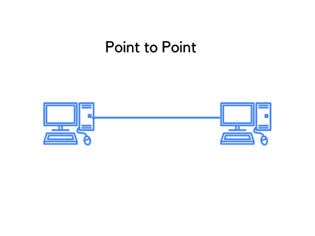
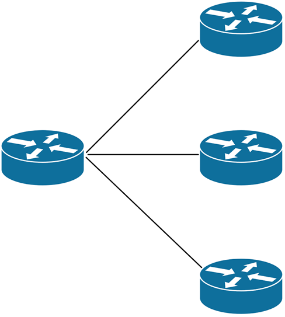
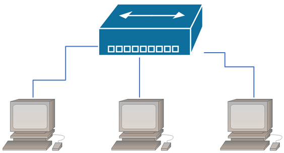

# Network+ Chapter 1

# **Physical Network Topologies**

**Physical topologies:** define the specific characteristics of a network: where all the workstations and other devices are located, and the precise arrangement of all the physical media (e.g cables).

**Logical topologies:** show how data moves through the network.

## **Bus Topology**

Contains:
- Two distinct and terminated ends.
- Each computer connecting to one unbroken cable running it's entire length.
- Does this by:
  - using wire taps (which didn't work well)
  - drop cables
  - if 10Base2 Ethernet slipping a "T" into the main cable wherever we wanted to connect a device to it, instead of a drop cable.

| **Advantages**| **Disadvantages**|
|---|---|
| Easy to install| Hard to troubleshoot/change/move|
| Not very expensive (doesn't require as much cable as other types of physical topologies) | Doesn't offer much fault tolerance (everything's connected to a single cable - fault in the cable can bring the network down) |

## **Star Topology**

All computers connected to a central point with their own individual cables / connections.

**Central spot**: hub / switch / access point.

| **Advantages** | **Disadvantages** |
|---|---|
| Decent Fault tolerance: since each computer/network segmentis connected to the central device individually, if the cable fails, it only brings down the machine / network segment related to the point of failure  | Installation cost higher because more cables needed (but prices are becoming competitive). |
| Scalable: Just run a new cable and connect it to the machine at the core of the star. | If the hub fails, the network fails. |
| Relatively easy to troubleshoot. |  |

### **Ring Topology**

Data flows from computer to computer, back to the source (imagine clockwise / anti-clockwise).

Has a lot in common with the bus topology, because if you want to add to the network, you have to break the cable ring, so you need to bring down the entire network.

| **Advantages** | **Disadvantages** |
|---|---|
| No collision of data. | Not fault tolerant: if you want to add to the network, you have to break the cable ring, so you will bring down the entire network. |
| High Speed: The data flows (anti)clockwise -> it flows unidirectionally. If data flows in one direction then the speed of data transfer is high. Also, data is transferred in the form of data packets (tokens) so the speed of data is high. | Pricey: need several cables to connect each computer |
|  | Really hard to configure |

### **Mesh Topology**

There's a path from every machine, to every other machine.

for *n* number of hosts, you end up with *n*(*n*-1)/2 connections.

- 4 computers: 6 connections
- 10 computers: 45 connections!

Therefore only small networks can really use this topology.

Good fault tolerance.

Can instead of creating this "full-mesh" topology, create a **partial mesh topology** instead. May lose a little fault tolerance (not all devices will be interconnected, so choose wisely).

### **Point-to-Point Topology**

Direct connection between routers/switches. Single communications path.

Lightning bolt = WAN link.

Also, a link froma computer to a hub/switch is also a valid P2P connection.

### **Point-to-Multipoint Topology**

A succession of connections between an interface on one router, and multiple destination routers / one to multiple connections.

### Hybrid Topology

A combination of two+ physical / logical network topologies working together within the same network.

**Example**: a LAN hub in a star topology configuration, that connects to its hosts via a bus topology.

